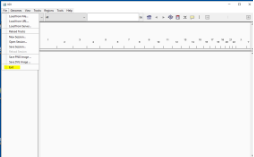
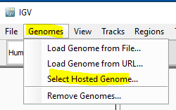
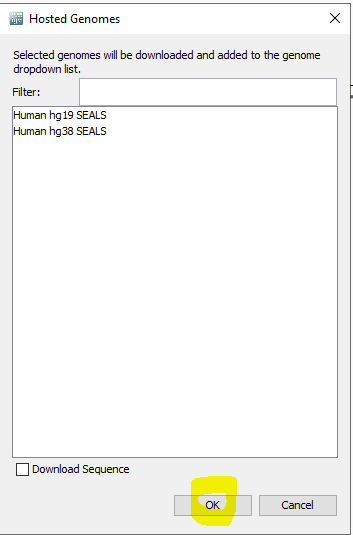

**	
**

# **Setup IGV for local Hosted Genomes Files**
This procedure is intended to outline the activities and responsibilities required to setup IGV application to use local Hosted Genomes Files of H19 and H38
# **Procedure**

|<h3></h3>|<h3>**Instruction**</h3>|<h3>**Illustration**</h3>|
| :- | :- | :- |
|1|Launch IGV|
![ref1]

|
|2|Go to View and select Preferences||
|3|
On the Preferences Windows, go to Advance tab, then **update the  Genome Server URL to <https://sealsweb.nswhealth.net/IGV/genomes.tsv>**

Then click Save

Close IGV

|

|
|4|Re launch IGV by double clicking on the icon|![ref1]	|
|5|
To use the local hosted file do as below:

a. Go to Genomes Tab, then select “Select Hosted Genomes”

&emsp;

b. On the Hosted Genomes Windows, select the hosted files needed ( i.e. either H19 or H38), then click OK
|

|
|6|
Use the application as normal

Done
||

Version 1.0	Date:  17 January 2021	Page 2 of 3

[ref1]: Aspose.Words.379eabba-9b65-4c01-9833-2a44b2133bdb.002.png
