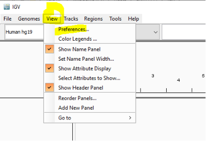
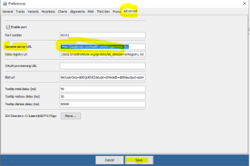

	

# **Setup IGV for local Hosted Genomes Files**
This procedure is intended to outline the activities and responsibilities required to setup IGV application to use local Hosted Genomes Files of hg19 and GRCh38
# **Procedure**

||**Instruction**|**Illustration**|
| :- | :- | :- |
|1|Launch IGV||
|2|Go to View and select Preferences||
|3|On the Preferences Windows, go to Advance tab, then **update the  Genome Server URL to <https://sealsweb.nswhealth.net/IGV/genomes.tsv>**Then click Save, Close IGV||
|4|Re launch IGV by double clicking on the icon||
|5|To use the local hosted file do as below: a. Go to Genomes Tab, then select “Select Hosted Genomes”&emsp;b. On the Hosted Genomes Windows, select the hosted files needed ( i.e. either hg19 or GRCh38), then click OK||
|6|Use the application as normal, Done||

Version 1.0	Date:  17 January 2021

